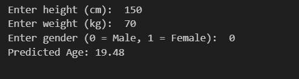

#  Age Prediction Model | Machine Learning Project

This project predicts a person's age using a machine-learning regression model trained on structured numerical data from an Excel dataset.
It demonstrates a complete ML pipeline including preprocessing, model training, evaluation, and prediction.

------------------------------------------------------------

##  Features
- Predicts age using input numerical features
- Regression-based ML model
- Includes data preprocessing & cleaning
- Proper train–test split
- Easy-to-run Jupyter Notebook
- Beginner-friendly, well-structured ML workflow

------------------------------------------------------------

##  Tech Stack
- Python
- NumPy
- Pandas
- Scikit-learn
- Matplotlib
- Jupyter Notebook

------------------------------------------------------------

##  Folder Structure

age-prediction-ml-model/

│── age_detection_dataset.xlsx

│── Age Detection Model.ipynb

│── requirements.txt

└── README.md

------------------------------------------------------------

##  How to Run the Project

1️⃣ Install dependencies

      pip install -r requirements.txt

2️⃣ Open the Jupyter Notebook

      jupyter notebook "Age Detection Model.ipynb"

3️⃣ Run all cells

This will:

  • Load the dataset

  • Preprocess features

  • Train the ML model

  • Evaluate performance

  • Show predictions

------------------------------------------------------------

##  Model Workflow
1. Load dataset from Excel
2. Handle missing values & clean data
3. Feature selection
4. Split into training and testing sets
5. Train regression model (e.g., Linear Regression / Random Forest)
6. Evaluate using MAE, RMSE, R²
7. Predict age for new input samples

------------------------------------------------------------

## Output

------------------------------------------------------------

##  Project Status
This project is complete and currently not planned for further updates.
It was developed for learning and demonstrating machine-learning concepts using regression models.

------------------------------------------------------------

##  Author
Arelli Sanjay

Aspiring LLM App Developer & AI Full-Stack Engineer

📧 Email: arellissanjay1105@gmail.com

🔗 LinkedIn: https://www.linkedin.com/in/sanjay-arelli-2b0970383
